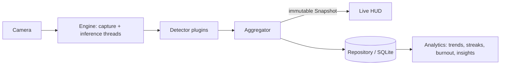

# StudyGuard AI


# The AI-powered Study Coach.

**[Demo](docs/DEMO_SCRIPT.md)** · **[Download](https://github.com/builedanhuygov-alt/studyguard-ai/releases)** · **[Documentation](docs/)** · **[Desktop](docs/DESKTOP.md)** · **[Dashboard](dashboard/app.py)** · **[API](docs/API_HTTP.md)** · **[Paper](docs/research/paper.md)** · **[Benchmark](docs/reports/BENCHMARK_DEVICES.md)**

**A privacy-first study coach that turns any webcam into on-device focus, posture,
and study-session intelligence — no video ever leaves your machine.**

> The camera is only one sensor. StudyGuard AI is built as a small, clean
> **study-intelligence platform**: behavioral signals → analytics → habits,
> trends, and personalized recommendations. See **[docs/PLATFORM.md](docs/PLATFORM.md)**.

---

## Why StudyGuard AI

Students spend hours "studying" with no feedback on *how well* it's going.
StudyGuard AI gives gentle, real-time signals and long-term insight — while
keeping every frame on-device.

What makes it worth your star isn't feature count, it's the engineering:

- 🔒 **Private by construction** — only derived metrics are stored; a CI test
  fails the build if a raw frame could ever be persisted.
- 🧩 **Genuinely extensible** — add a detector *or a whole data source* (calendar,
  LMS, wearable) in one class via plugin systems; swap SQLite for Postgres behind
  one protocol; no core edits.
- 🔌 **Multi-source by design** — the camera is one `DataSource`
  (`connect/collect/validate/health_check`); a stable service API feeds any UI.
- 🧪 **Tested & typed** — unit + integration + mock tests, `mypy`, `ruff`,
  `black`, coverage, pre-commit, and GitHub Actions on Python 3.11 & 3.12.
- 🧠 **Clean Architecture** — CV is isolated behind protocols; the domain logic
  (sessions, alerts, analytics) is pure and deterministic.
- 🛡️ **Reliable by design** — newest-frame-wins threading, graceful camera
  fallback, presence hysteresis (no single-frame false alarms).

## What it looks like

```text
┌─ StudyGuard AI ────────────────── FOCUSED ─── 28.6 FPS ─┐
│                                                        │
│   Posture  ██████████████░░░░  82                        │
│   Focus    ████████████████░  91                        │
│                                                        │
│   Great posture and focus                              │
│   Session 00:42   Distractions: 1                      │
└─────────────────────────────────────────────┘
```
<sub>Illustrative HUD layout (drawn live with OpenCV).</sub>

## Quickstart

```bash
python -m venv .venv && source .venv/bin/activate
pip install -e .

studyguard --fake        # try it with no camera (deterministic)
studyguard               # use your webcam
studyguard --video demo.mp4   # replay a clip (great for demos)
```

Run the checks:

```bash
pip install -e ".[dev]"
pytest -q                # unit + integration + mock tests
```

## How it works



Full design (layers, threading, sequence, state machine) is in
**[docs/ARCHITECTURE.md](docs/ARCHITECTURE.md)**.

## Run it your way

```bash
streamlit run dashboard/app.py     # SaaS-style analytics dashboard  (pip install -e ".[dashboard]")
studyguard-api                     # REST API + Swagger at /docs      (pip install -e ".[api]")
studyguard-desktop                 # native desktop window + tray     (pip install -e ".[desktop]")
```

Windows users can install the packaged **.exe** (no Python needed) — see
**[docs/DESKTOP.md](docs/DESKTOP.md)** and the release installer.

## Extend it: your own detector in ~15 lines

No core changes — implement the protocol, decorate, done. Third-party packages
can ship detectors via a `studyguard.detectors` entry point.

```python
import numpy as np
from studyguard.core import Analysis, register_detector

@register_detector
class BrightnessDetector:
    """Warn when the room is too dark to study (or to detect well)."""

    name = "lighting"

    def analyze(self, frame: np.ndarray) -> Analysis:
        brightness = float(frame.mean())  # 0-255
        return Analysis(
            name=self.name,
            present=brightness > 15.0,
            metrics={"brightness": brightness},
        )
```

Swapping storage is just as small — implement `Repository.save/close` (e.g. for
Postgres/TimescaleDB) and inject it in the composition root.

## Study-intelligence layer

Beyond the live view, a **sensor-agnostic** analytics engine turns stored metrics
into daily stats, focus/posture **trends**, study **streaks**, a **burnout-risk**
signal, **insights**, and personalized **recommendations** — all pure functions,
ready for a learned model to replace the rule-based v0. See
**[docs/PLATFORM.md](docs/PLATFORM.md)**.

## Privacy

Processing is 100% on-device. Only derived metrics (scores, timestamps, session
stats) are stored — **raw frames are never persisted or logged**. This is
enforced structurally and guarded by `tests/test_privacy.py`, which fails CI if
a raw-media field is ever introduced.

## Project quality

- **Tests:** unit (`tests/`), integration (`tests/integration/`), and mock-based.
- **Tooling:** `ruff`, `black`, `mypy` (typed, `py.typed`), coverage, pre-commit.
- **CI/CD:** GitHub Actions matrix (3.11/3.12) + tag-triggered release workflow.
- **Docker:** reproducible image; `docker compose run tests`.
- **Docs:** [Architecture](docs/ARCHITECTURE.md) · [Platform](docs/PLATFORM.md) · [Data Sources](docs/DATA_SOURCES.md) · [AI Coach](docs/AI_COACH.md) · [HTTP API](docs/API_HTTP.md) ·
  [API](docs/API.md) · [Developer Guide](docs/DEVELOPMENT.md) ·
  [Deployment](docs/DEPLOYMENT.md) · [Troubleshooting](docs/TROUBLESHOOTING.md) ·
  [Roadmap](docs/ROADMAP.md).
- **Community:** [Contributing](CONTRIBUTING.md) · [Security](SECURITY.md) ·
  [Code of Conduct](CODE_OF_CONDUCT.md) · [Changelog](CHANGELOG.md).

## Engineering reports
- [Status matrix](docs/STATUS.md) (Implemented / Verified / Experiment / Planned)
- [Architecture](docs/reports/ARCHITECTURE_REPORT.md) · [Technical debt](docs/reports/TECH_DEBT.md) · [Performance](docs/reports/PERFORMANCE.md)
- [Security review](docs/reports/SECURITY_REVIEW.md) · [Testing](docs/reports/TESTING.md) · [AI evaluation](docs/reports/EVALUATION.md)

## Status & honesty

StudyGuard AI is **v0.1.0 (alpha)**. What is true today:

- ✅ Core engine, detectors, storage, sessions, and analytics are implemented and
  covered by tests.
- ⚠️ Posture/focus use an **explainable heuristic** (OpenCV Haar + face geometry);
  the burnout and recommendation logic is a **rule-based v0**. These are **not**
  yet validated on real students — accuracy work is tracked in the roadmap.
- ❌ No accuracy or learning-outcome numbers are claimed until measured.

## Model evaluation

Measured by `tools/run_evaluation.py` on a **synthetic geometry dataset (2,000
noisy samples)** — it quantifies how well the posture/focus decision logic
recovers the latent study state. **These are self-evaluation numbers, not yet
human-validated.** Reproduce: `PYTHONPATH=. python tools/run_evaluation.py`.

| Task | Precision | Recall | F1 |
| --- | --- | --- | --- |
| Posture detection | 100.0% | 88.2% | **93.8%** |
| Focus detection | 100.0% | 92.4% | **96.1%** |
| Status (macro) | 95.9% | 95.0% | **95.3%** |

Focus ROC-AUC: 1.00. Full report + confusion matrix: [docs/reports/EVALUATION_RESULTS.md](docs/reports/EVALUATION_RESULTS.md).
To publish **human-validated** numbers, label real clips with `tools/label_clip.py`
and re-run — the README table then reflects real footage.

## Benchmark

Reproduce: `PYTHONPATH=. python benchmarks/report.py`. Measured on the CI sandbox
(Py 3.13, headless): **22.8 detector FPS @640×480**, 43.8 ms latency, 8,322
SQLite writes/s, ~131 ms cold import. Per-device table (fill via PR):
[docs/reports/BENCHMARK_DEVICES.md](docs/reports/BENCHMARK_DEVICES.md).

## Try it with no webcam (judge-friendly)

```bash
studyguard demo            # scripted, data-driven walkthrough in the terminal
studyguard present         # looped Presentation Mode for a live pitch
streamlit run dashboard/app.py    # full UI on seed data
```

## Architecture diagrams
UML, sequence, ERD, component, and deployment diagrams: [docs/DIAGRAMS.md](docs/DIAGRAMS.md).

## Design system
A full commercial design system — tokens (CSS/Tailwind/Flutter/Material), brand +
logo, component/screens/motion/accessibility specs, and a Figma-ready spec — lives
in **[design/](design/README.md)**. The shipping website, desktop, and dashboard
UIs already consume the shared tokens (`design/tokens/tokens.css`).

## Contributing

Contributions are welcome — see **[CONTRIBUTING.md](CONTRIBUTING.md)** (Conventional
Commits, tests, and the quality gates above). Good first issues: a new detector,
a storage backend, or labeled eval clips.

## License

[MIT](LICENSE) © StudyGuard AI contributors
