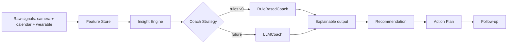

# AI Coach: from rules to LLM (Phase 6)

The coach is a **strategy** (`studyguard/coach/strategy.py`): `RuleBasedCoach`
today, an `LLMCoach` later — same interface, no caller changes.

## Pipeline

## What exists today (verified)
`weekly_summary` (`studyguard/coach/summary.py`) already produces the target
narrative from real data, e.g.:

> “This week you studied about 19 hours. Your focus is highest around 8 PM–10 PM.
> Performance drops on Tuesday and Friday (down about 25%). Schedule your hardest
> subjects during your peak focus window.”

Every line is backed by computed facts (hours, hourly focus, per-weekday focus).

## LLMCoach (extension point, not shipped)
An `LLMCoach.generate(daily, points)` would: build a compact **feature summary**
(the same structured facts), prompt an LLM to phrase advice, and **ground every
claim** in the provided metrics (no ungrounded generation). Confidence and
evidence remain mandatory. The feature summary keeps raw frames out of any
prompt (privacy invariant preserved).

Status: ✅ strategy seam + verified weekly narrative. ❌ No LLM integration shipped.
