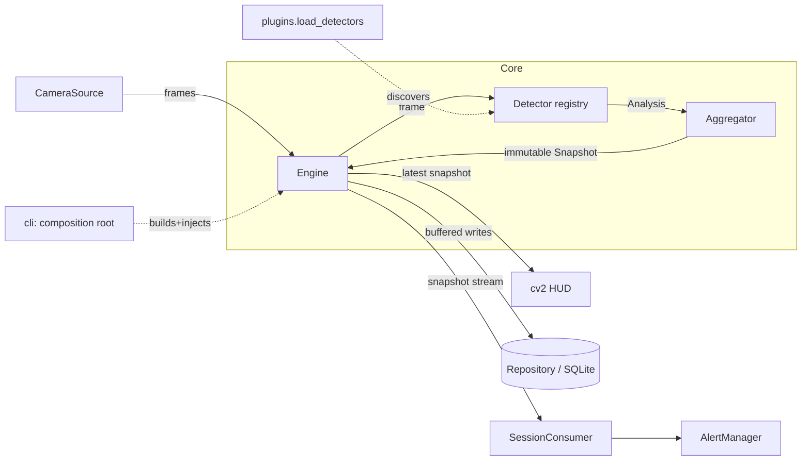
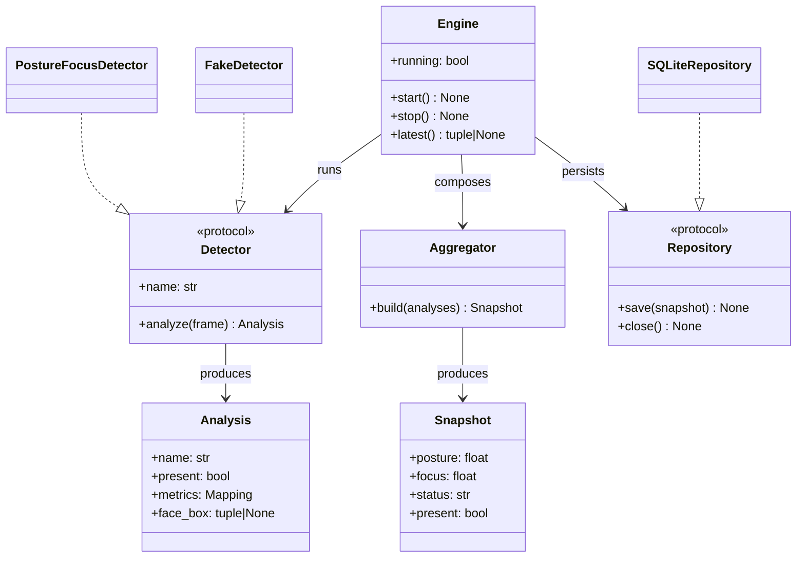
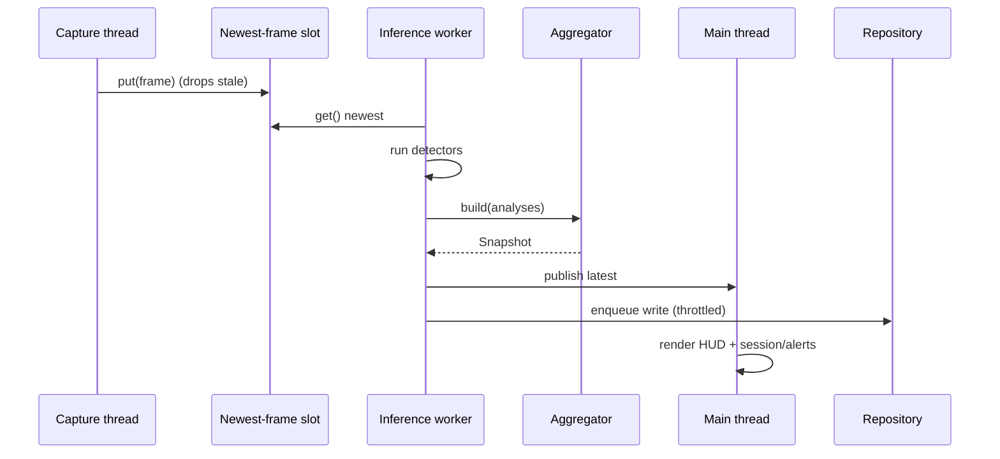
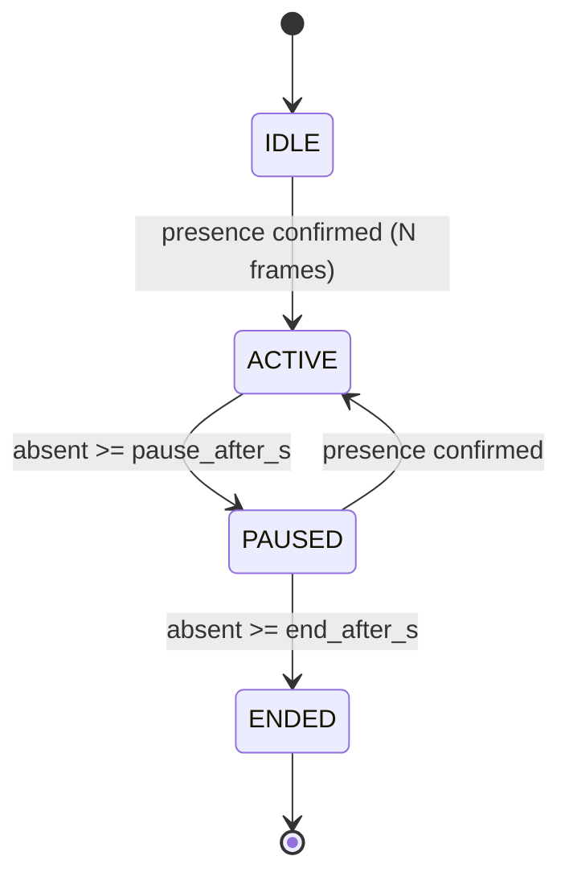

# Architecture

StudyGuard AI follows a layered, dependency-inverted design. Computer vision is
isolated behind protocols so the domain logic (sessions, alerts, analytics) is
pure, deterministic, and unit-testable without a camera.

## Layers

| Layer | Package | Responsibility | Depends on |
| --- | --- | --- | --- |
| Presentation | `studyguard.hud` | Draw the HUD from an immutable snapshot | core (types) |
| Application | `studyguard.cli`, `studyguard.session` | Composition root (DI), session state, alerts | core, infra |
| Domain / Core | `studyguard.core` | Engine, protocols, immutable results, aggregator | — |
| Plugins | `studyguard.detectors`, `studyguard.plugins` | Detector implementations + discovery | core |
| Infrastructure | `studyguard.camera`, `studyguard.storage` | OpenCV capture, SQLite repository | core (types) |
| Cross-cutting | `studyguard.config`, `studyguard.logging_conf`, `studyguard.privacy` | Config, logging, privacy guard | — |

**Dependency rule:** dependencies point inward. Infrastructure and plugins
depend on core abstractions (`Detector`, `Repository`), never the reverse.

## Component view

## Class view (core contracts)

## Runtime sequence (one frame)

## Session state machine

## Concurrency & backpressure
- One **capture thread** owns the camera lifecycle and publishes the newest
  frame into a single-slot buffer (`queue.Queue(maxsize=1)`), dropping stale
  frames so latency never accumulates.
- One **inference worker** runs detectors + aggregator and publishes the latest
  snapshot; a separate **writer thread** persists throttled samples so the DB
  never blocks capture.
- The **main thread** renders (OpenCV GUI is main-thread only on macOS).
- We deliberately use threads rather than `asyncio`: the workload is CPU-bound
  OpenCV calls that release the GIL, and the model is simpler to reason about.

## Reliability & graceful degradation
- Camera cannot open -> friendly message + suggestion to use `--video`/`--fake`.
- A failing detector or consumer is caught and logged; the loop never dies.
- Temporary face/pose loss is absorbed by presence hysteresis (no single-frame
  state changes) before a session pauses or ends.
- Large time gaps (laptop asleep) are clamped so study statistics stay honest.

## Extension points
- **New detector:** implement `Detector.analyze` + `@register_detector` (+ entry
  point for external packages). No core changes.
- **New storage backend:** implement `Repository.save/close` (e.g. Postgres or
  TimescaleDB) and inject it in the composition root.

## Design decisions (ADRs)
Key decisions are recorded as ADRs in the project workspace: runtime/UI split,
concurrency & backpressure, detector/repository seams, and plan sequencing.
