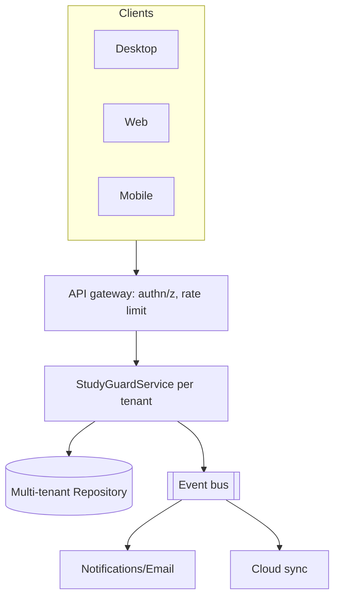

# Commercial Architecture (Phase 5) — design + extension points

> Status: **architecture only.** Not implemented — the current product is
> single-user and on-device. This documents how it scales to a SaaS without
> breaking the existing domain.

## Multi-tenancy
All domain rows gain a `tenant_id` + `user_id`; the `Repository` protocol is
implemented by a Postgres/Timescale backend. Analytics/coach stay unchanged
(they already consume generic `MetricPoint`s).

## Identity & accounts
- Auth: OAuth/OIDC + JWT sessions (primitives already in `studyguard/security.py`).
- Roles: student, teacher, parent, org-admin, super-admin → scope every query.

## Portals (all read the same service/API)
Student, Team, Classroom, Teacher, Parent, Organization, Analytics, Admin — each
is a filtered view over the service with a role scope. No new business logic.

## Notifications & email
`Notification` plugin type (seam) + providers (email/push/Discord). Triggered by
domain events (goal reached, streak broken, burnout elevated).

## Subscription (architecture only)
Plans gate features via a `PlanPolicy` checked at the gateway; billing provider
(e.g. Stripe) behind a `BillingProvider` interface. No billing code shipped.

## Cloud sync
Local-first; a `SyncProvider` pushes derived metrics (never raw frames) to the
tenant backend when the user opts in.
