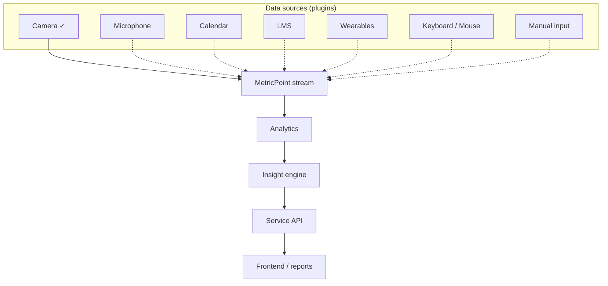

# Data Sources (Multi-Source Architecture)

StudyGuard AI is **not** designed around the webcam. Every input is a plugin
implementing one interface; the engine and analytics depend only on that
interface and on sensor-agnostic `MetricPoint` records.

## The `DataSource` contract

Every source implements (`studyguard/sources/base.py`):

| Method | Purpose |
| --- | --- |
| `connect()` | Establish access (idempotent) |
| `disconnect()` | Release resources (safe if already disconnected) |
| `collect()` | Return new `MetricPoint`s (possibly empty) |
| `validate()` | Is the source configured correctly? |
| `health_check()` | Report status without raising |

Sources register with `@register_source("key")` and are created via
`create_source(key, **config)` — **no existing code changes** to add one
(Open/Closed).


✓ = implemented today. Dotted = documented extension points.

## Status

| Source | Category | Status |
| --- | --- | --- |
| Camera | sensor | ✅ implemented (`camera_source.py`) |
| Google / Notion / Outlook / Apple Calendar | calendar | ❌ extension point |
| Coursera / Udemy / edX / Moodle / Google Classroom / Canvas | lms | ❌ extension point |
| Apple Watch / Garmin / Fitbit / Galaxy Watch | wearable | ❌ extension point |
| Microphone, Keyboard/Mouse, Manual input | sensor/manual | ❌ extension point |

## Adding a source (example: a calendar provider)

```python
from collections.abc import Sequence
from studyguard.analytics.models import MetricPoint
from studyguard.sources.base import SourceHealth, SourceInfo, SourceStatus, register_source

@register_source("google_calendar")
class GoogleCalendarSource:
    info = SourceInfo("google_calendar", "Google Calendar", "calendar", requires_consent=True)

    def __init__(self, token: str | None = None) -> None:
        self._token = token
        self._connected = False

    def connect(self) -> None: self._connected = True
    def disconnect(self) -> None: self._connected = False
    def validate(self) -> bool: return self._token is not None
    def health_check(self) -> SourceHealth:
        return SourceHealth(SourceStatus.CONNECTED if self._connected else SourceStatus.DISCONNECTED)
    def collect(self) -> Sequence[MetricPoint]:
        # map planned vs actual study time to MetricPoint(metric="planned_minutes", ...)
        return []
```
Nothing else changes: analytics, insight engine, reports, and the API consume it
automatically once connected (with consent).

## Wearables are optional
The app functions fully with **no** wearable connected. Optional health metrics
(heart rate, HRV, stress, movement, standing time) simply add corroborating
observations that can raise insight confidence when present.

## Privacy & consent
- No integration is mandatory; each requires **explicit consent** (`ConsentStore`).
- Users can **disconnect**, **delete** imported data, and **export** their data
  (`DataRights`, exposed via the API).
- Only derived metrics are stored; stored personal information is minimized.
