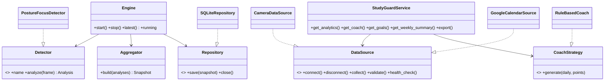
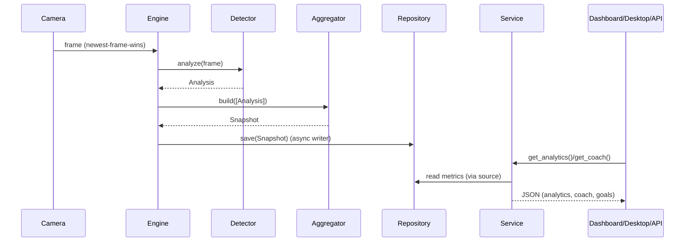
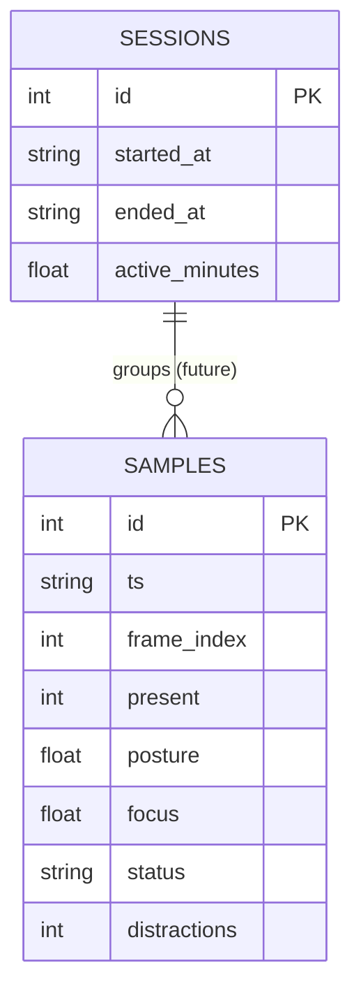
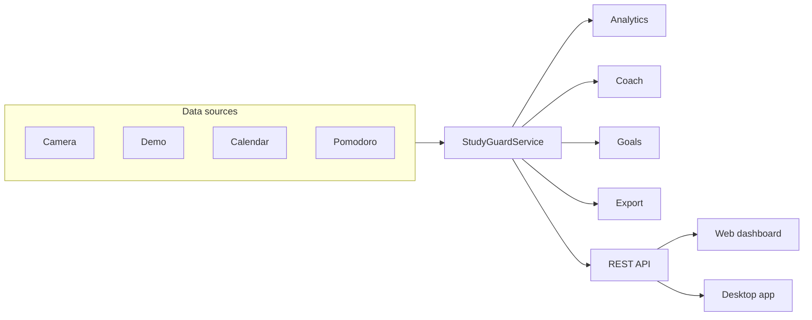
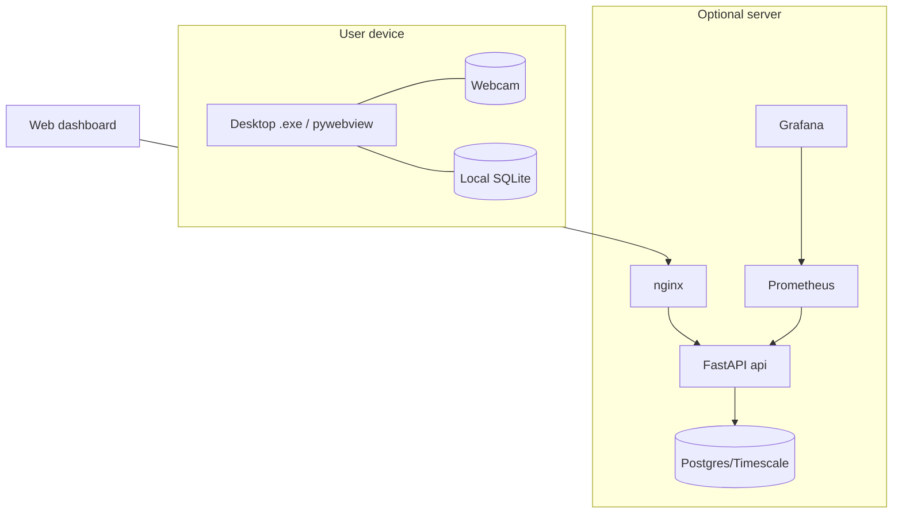

# Diagrams (UML, Sequence, ERD, Component, Deployment)

## Class diagram (UML)

```mermaid
classDiagram
    class Detector { <<protocol>> +name +analyze(frame) Analysis }
    class Repository { <<protocol>> +save(snapshot) +close() }
    class DataSource { <<protocol>> +connect() +disconnect() +collect() +validate() +health_check() }
    class CoachStrategy { <<protocol>> +generate(daily, points) }
    class Aggregator { +build(analyses) Snapshot }
    class Engine { +start() +stop() +latest() +running }
    class StudyGuardService { +get_analytics() +get_coach() +get_goals() +get_weekly_summary() +export() }
    Engine --> Detector
    Engine --> Aggregator
    Engine --> Repository
    StudyGuardService --> DataSource
    StudyGuardService --> CoachStrategy
    PostureFocusDetector ..|> Detector
    SQLiteRepository ..|> Repository
    CameraDataSource ..|> DataSource
    GoogleCalendarSource ..|> DataSource
    RuleBasedCoach ..|> CoachStrategy
```

## Sequence diagram (one frame -> UI)

```mermaid
sequenceDiagram
    participant Cam as Camera
    participant Eng as Engine
    participant Det as Detector
    participant Agg as Aggregator
    participant Repo as Repository
    participant Svc as Service
    participant UI as Dashboard/Desktop/API
    Cam->>Eng: frame (newest-frame-wins)
    Eng->>Det: analyze(frame)
    Det-->>Eng: Analysis
    Eng->>Agg: build([Analysis])
    Agg-->>Eng: Snapshot
    Eng->>Repo: save(Snapshot)  (async writer)
    UI->>Svc: get_analytics()/get_coach()
    Svc->>Repo: read metrics (via source)
    Svc-->>UI: JSON (analytics, coach, goals)
```

## ERD (persisted metrics)

```mermaid
erDiagram
    SAMPLES {
      int id PK
      string ts
      int frame_index
      int present
      float posture
      float focus
      string status
      int distractions
    }
    SESSIONS ||--o{ SAMPLES : "groups (future)"
    SESSIONS {
      int id PK
      string started_at
      string ended_at
      float active_minutes
    }
```

## Component diagram

```mermaid
flowchart LR
    subgraph Sources[Data sources]
      C[Camera]; D[Demo]; Cal[Calendar]; P[Pomodoro]
    end
    Sources --> SVC[StudyGuardService]
    SVC --> AN[Analytics]
    SVC --> CO[Coach]
    SVC --> GO[Goals]
    SVC --> EX[Export]
    SVC --> API[REST API]
    API --> WEB[Web dashboard]
    API --> DESK[Desktop app]
```

## Deployment diagram

```mermaid
flowchart TB
    subgraph Client[User device]
      DESK[Desktop .exe / pywebview]
      CAMERA[(Webcam)]
      DB[(Local SQLite)]
      DESK --- CAMERA
      DESK --- DB
    end
    subgraph Server[Optional server]
      NGINX[nginx] --> APISVC[FastAPI api]
      APISVC --> PG[(Postgres/Timescale)]
      PROM[Prometheus] --> APISVC
      GRAF[Grafana] --> PROM
    end
    Browser[Web dashboard] --> NGINX
```
